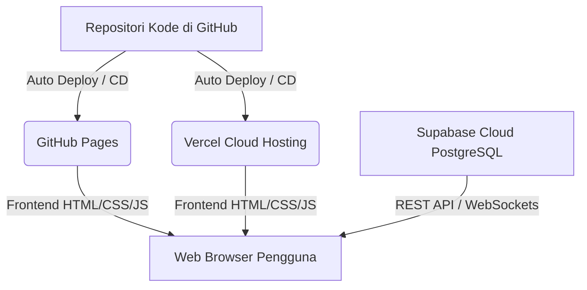

# Panduan Implementasi PIT-TRACK: Arsitektur 100% Gratis via GitHub, Vercel, & Supabase

Rencana ini memandu Anda membuat deployment sistem **PIT-TRACK** secara **100% gratis selamanya** (tanpa kartu kredit) menggunakan kombinasi platform developer modern.

Kami merekomendasikan dua opsi hosting frontend gratis: **GitHub Pages** (sederhana & resmi dari GitHub) atau **Vercel** (sangat cepat, memiliki fitur *Continuous Deployment* otomatis, dan manajemen variabel lingkungan).

---

## 🎨 Ringkasan Alur Sistem



---

## 🚀 OPSI A: Hosting Frontend Gratis di Vercel (Sangat Direkomendasikan)

Vercel adalah platform cloud modern yang terintegrasi secara mendalam dengan GitHub. Setiap kali Anda melakukan perubahan kode di komputer lokal lalu mengetik `git push` ke GitHub, Vercel secara otomatis mendeteksi perubahan tersebut dan memperbarui website online Anda dalam waktu kurang dari 10 detik (*Continuous Deployment*).

### Langkah-langkah Deployment di Vercel:

1. **Daftar Akun Vercel**:
   * Kunjungi [Vercel](https://vercel.com).
   * Klik **Sign Up** dan pilih **Continue with GitHub**. Otorisasi akun GitHub Anda.
2. **Hubungkan Repositori**:
   * Pada dashboard Vercel, klik tombol **Add New...** di kanan atas dan pilih **Project**.
   * Vercel akan menampilkan daftar repositori GitHub Anda.
   * Cari repositori dashboard Anda (misalnya: `dashboard-subkon`), lalu klik tombol **Import**.
3. **Konfigurasi Proyek**:
   * **Framework Preset**: Karena kita menggunakan HTML, CSS, dan JS murni (Vanilla), Vercel akan otomatis mendeteksinya sebagai **Other** (Statis). Biarkan default.
   * **Root Directory**: `./` (Biarkan default).
   * **Environment Variables (Opsional & Sangat Aman)**:
     * Dibandingkan menuliskan Kunci API Supabase secara langsung di kode JavaScript (*hardcoded*), Anda dapat menyimpannya secara aman di panel ini.
     * Masukkan Key: `SUPABASE_URL` dan Value: `https://your-project-id.supabase.co`.
     * Masukkan Key: `SUPABASE_ANON_KEY` dan Value: `eyJhbGciOi...`.
4. **Deploy**:
   * Klik tombol **Deploy**. Dalam waktu 10-15 detik, proyek Anda selesai dibuat!
   * Vercel akan memberikan domain gratis kustom berkualitas tinggi dengan protokol HTTPS aktif secara otomatis, seperti:  
     `https://dashboard-subkon.vercel.app` (atau variasi nama unik lainnya).

---

## 💻 OPSI B: Hosting Frontend Gratis di GitHub Pages

Opsi klasik dan bawaan resmi dari repositori GitHub Anda.

### Langkah-langkah Deployment di GitHub Pages:

1. **Unggah Kode ke GitHub**:
   * Push seluruh file dari folder `d:\WEB\DASHBOARD SUBKON` ke repositori GitHub Anda.
2. **Aktifkan Fitur Pages**:
   * Buka menu **Settings** pada repositori GitHub Anda.
   * Klik menu **Pages** di kolom navigasi sebelah kiri.
   * Di bawah bagian **Build and deployment**, pastikan Source diatur ke **Deploy from a branch**.
   * Pilih branch utama Anda (biasanya bernama **main** atau **master**), pilih folder **/ (root)**, kemudian klik **Save**.
3. **Selesai**:
   * Tunggu sekitar 1 menit. Segarkan halaman, dan GitHub akan memberikan link website aktif Anda, contoh:  
     `https://<username-github>.github.io/dashboard-subkon/`

---

## 💾 Integrasi Database PostgreSQL Cloud Gratis di Supabase

Supabase menyediakan database cloud PostgreSQL tangguh secara gratis selamanya selama proyek Anda aktif. Supabase juga mendukung modul spasial **PostGIS** untuk pemetaan wilayah tambang.

### Cara Menghubungkan Frontend ke Supabase:

1. **Tambahkan Script Client Supabase di `index.html`**
   Tambahkan library resmi di bagian bawah `index.html` (di atas tag script lokal Anda):
   ```html
   <!-- Supabase JS Client Library -->
   <script src="https://cdn.jsdelivr.net/npm/@supabase/supabase-js@2"></script>
   ```

2. **Inisialisasi & Query Data di `js/app.js`**
   Hubungkan JavaScript ke database Supabase Anda:
   ```javascript
   // Hubungkan ke Supabase (Membaca Environment Variable jika memakai Vercel, atau string cadangan jika lokal)
   const SUPABASE_URL = window.process?.env?.SUPABASE_URL || "https://your-project-id.supabase.co";
   const SUPABASE_ANON_KEY = window.process?.env?.SUPABASE_ANON_KEY || "eyJhbGciOiJIUzI1NiIsInR5cCI6IkpXVCJ9.your-anon-key";
   
   const supabase = supabase.createClient(SUPABASE_URL, SUPABASE_ANON_KEY);

   // AMBIL DATA UNIT DARI CLOUD DATABASE
   async function getRealtimeUnits() {
       const { data, error } = await supabase
           .from('units')
           .select('*');
       
       if (data && !error) {
           unitsData = data; // Ganti data mock simulasi dengan data database riil!
           updateUI();
           updateMapMarkers();
       }
   }
   ```

---

## 📊 Skema Struktur Database di Supabase (SQL Script)

Salin kode SQL di bawah ini, buka dashboard Supabase Anda, masuk ke menu **SQL Editor**, buat **New Query**, tempelkan kode berikut, lalu klik **Run**:

```sql
-- 1. Aktifkan Ekstensi Pemetaan Geospasial
CREATE EXTENSION IF NOT EXISTS postgis;

-- 2. Tabel Subkontraktor
CREATE TABLE subcontractors (
    id VARCHAR(50) PRIMARY KEY,
    name VARCHAR(150) NOT NULL,
    code VARCHAR(10) NOT NULL,
    rating NUMERIC(3,2) DEFAULT 5.00,
    incidents INTEGER DEFAULT 0,
    contact VARCHAR(50)
);

-- 3. Tabel Unit Armada (Mendukung Spasial Koordinat GPS)
CREATE TABLE units (
    id VARCHAR(50) PRIMARY KEY,
    name VARCHAR(100) NOT NULL,
    type VARCHAR(50) NOT NULL,
    subcon_id VARCHAR(50) REFERENCES subcontractors(id),
    operator VARCHAR(150) NOT NULL,
    status VARCHAR(50) DEFAULT 'Idle',
    fuel NUMERIC(5,2) DEFAULT 100.00,
    fuel_capacity NUMERIC(6,2),
    speed NUMERIC(5,2) DEFAULT 0.00,
    hm NUMERIC(8,2) DEFAULT 0.00,
    odometer NUMERIC(10,2) DEFAULT 0.00,
    temp NUMERIC(5,2) DEFAULT 75.00,
    lat DOUBLE PRECISION,
    lng DOUBLE PRECISION,
    geom GEOMETRY(Point, 4326), -- Data Geospasial untuk kueri peta cepat
    payload VARCHAR(100),
    payload_capacity NUMERIC(6,2)
);

-- 4. Tabel Log Alarm Real-Time
CREATE TABLE alerts_log (
    id BIGSERIAL PRIMARY KEY,
    timestamp TIMESTAMPTZ DEFAULT NOW(),
    unit_id VARCHAR(50) REFERENCES units(id),
    severity VARCHAR(20) NOT NULL,
    message TEXT NOT NULL,
    resolved BOOLEAN DEFAULT FALSE
);
```
